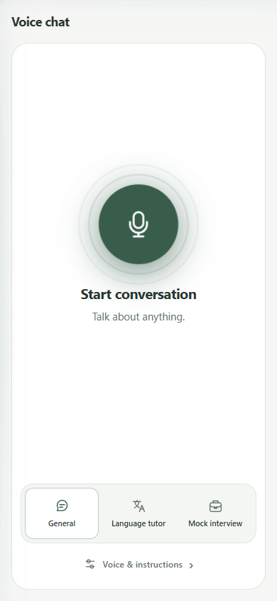
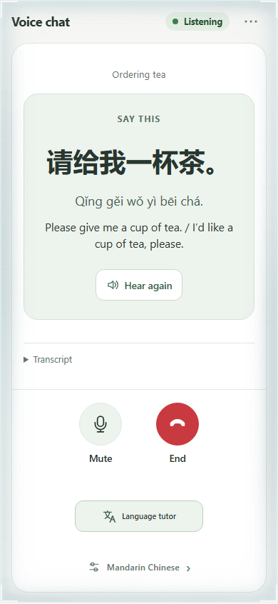

# GPT Live Voice

Voice chat, language tutoring, and interview practice with GPT Live.
Runs on Cloudflare Workers or Azure Static Web Apps.

Tutor phrases and interview questions stay in view while you speak.
**Hear again** repeats the current phrase; **Transcript** opens the conversation log.

<p>
  
  
</p>

## Run locally

Requires Node.js 22+, npm, and an Azure APIM gateway with
`/openai/v1/live/sessions` support.

Create `.dev.vars`:

```dotenv
AZURE_OPENAI_BASE_URL=https://gateway.example.com/general/openai/v1
AZURE_OPENAI_API_KEY=your-apim-subscription-key
```

```bash
npm ci
npm run dev
```

Open http://localhost:8787.

## Configuration

| Environment variable | Value |
| --- | --- |
| `AZURE_OPENAI_BASE_URL` | APIM gateway URL ending in `/openai/v1`. |
| `AZURE_OPENAI_API_KEY` | APIM subscription key. |
| `AZURE_OPENAI_DEPLOYMENT_NAME` | Defaults to `gpt-live-1`. |
| `AZURE_OPENAI_REASONING_DEPLOYMENT_NAME` | Defaults to `gpt-5.6-luna`. |

APIM authenticates to Foundry with managed identity.

## Deploy

### Cloudflare Workers

Set your Worker names and domain in `wrangler.jsonc` and the target checks in
`scripts/deploy-preview.mjs` and `scripts/deploy-with-domain.mjs`.

The [deployment workflow](.github/workflows/deploy-worker.yml) deploys `main`
automatically. Manual runs default to a preview dry-run. GitHub configuration:

- Secrets: `CLOUDFLARE_API_TOKEN`, `LIVE_PREVIEW_ENV`, `LIVE_PRODUCTION_ENV`.
- Variable: `CLOUDFLARE_ACCOUNT_ID`.

Each `LIVE_*_ENV` is a JSON object containing the server variables above.
For CLI deployment, authenticate with Cloudflare and export the corresponding
`LIVE_*_ENV` in your shell. Bash is required.

```bash
npm run deploy:preview
npm run deploy:production  # Requires main
```

### Azure Static Web Apps

Create a Static Web App. Export the server variables, `SWA_APP_NAME`, and
`SWA_RESOURCE_GROUP`, then configure it:

```bash
az login
npm run setup:swa -- --apply
```

Export `SWA_CLI_DEPLOYMENT_TOKEN` with the app's deployment token:

```bash
npm run deploy:swa                  # Preview
npm run deploy:swa -- --production  # Requires main
```

Setup targets production unless `SWA_ENVIRONMENT_NAME` names an existing preview.
These commands read shell variables, not `.dev.vars`.

For local SWA development, export the server variables and run `npm run dev:swa`.
Requires Azure Functions tooling; serves http://localhost:4280.

## Checks

```bash
npm test
npm run test:deployment
npm run typecheck
npm run deploy:dry-run
npm run deploy:preview:dry-run
```

## Structure

The server creates sessions through APIM. The browser sends audio directly to the
service over WebRTC.

| Path | Purpose |
| --- | --- |
| `public/` | UI, audio sessions, transcripts, and local history. |
| `api/shared/` | Session requests and prompts. |
| `src/worker.ts` | Cloudflare adapter. |
| `api/connect/` | Azure Functions adapter. |
| `test/` | Client and backend tests. |

[OpenAI Live guide](https://developers.openai.com/api/docs/guides/live).
Tutor interaction ideas inspired by
[HeyGen's GPT Live demos](https://github.com/heygen-com/liveavatar-gpt-live-demos).
